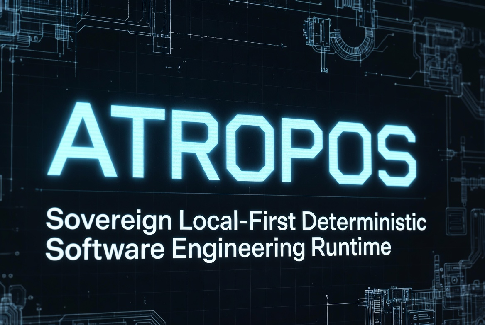
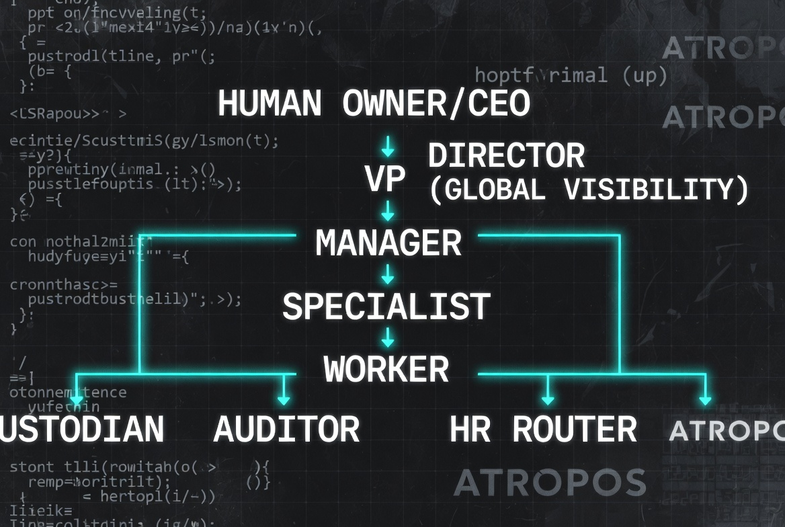

# ATROPOS

**The Sovereign Local-First Deterministic Hierarchical Multi-Swarm Software Development Engine**

**Independent • Runs for days without stopping • No quota collapse • Preventive verification • E(Δ)=0**

ATROPOS is a complete autonomous software-development engine and control plane. It is built on a strict hierarchical territory model with explicit scope boundaries, preventive drift detection, and controlled information flow. This architecture allows it to operate for days on end with no quota collapse, no uncontrolled context growth, and real deterministic verification before any LLM escalation.

Current systems (Codex CLI, Claude Code Agent Teams, Google Antigravity, OpenSwarm, AgentsMesh, and similar orchestrators) all rely on LLM-mediated coordination through task lists, mailboxes, and reviewer agents. This creates structural problems that become severe at scale: token cost grows super-linearly with agent count and duration, drift detection remains reactive and expensive, global visibility stays fragmented, and long-running autonomous work becomes unsustainable.

ATROPOS replaces that model entirely with territory assignment at dispatch time, continuous low-cost Director-level diff monitoring for preventive drift detection, a single auditable HR Router for cross-boundary information, and deterministic verification (Tree-sitter + DLOI) before any model call. Most work stays inside its assigned territory and never touches heavy coordination layers.

---

## Core Hierarchy

**Human Owner/CEO**  
Strategic direction, policy definition, and final authority on irreversible actions and risk tolerance. This level is not agentified.

**Director**  
Owns task decomposition, explicit territory assignment at dispatch time, global diff monitoring across all active worktrees, preventive drift detection, escalation handling, and maintenance of the single source of truth for scope and state. Only this layer requires broad visibility.

**VP / Manager**  
VP layers own major capability domains (Code Synthesis, Verification, Research/Ingestion, Assets, CI/Deployment). Managers handle team-level coordination within a domain, assign explicit territories to Specialists and Workers, track progress, and escalate scope or policy issues.

**Specialist**  
Deep domain expertise execution with higher verification requirements and narrower territory defaults. Registered with capability tags for intelligent routing.

**Worker**  
Executes assigned tasks strictly inside the granted territory in its dedicated worktree. Does not require visibility into other agents’ work.

**Custodian**  
Deterministic hygiene layer. Handles temp file removal, dead branch pruning, artifact cleanup, and basic state compaction on fixed schedules or Director triggers with minimal LLM involvement.

**Auditor**  
Independent read-only verification layer with a separate reporting line to prevent execution-layer capture. Performs syntax, structural consistency, and policy compliance checks.

**HR / Information Router**  
The single controlled chokepoint for any cross-territory information request. Applies redaction patterns, scope validation against territory metadata, and risk classification. Approved narrow responses are returned. Denied or high-risk requests are logged and escalated. Most intra-territory work bypasses the router entirely.

This hierarchy keeps coordination cost linear with the number of active territories rather than exploding with agent count or session length.

---

## Quantifiable Advantages Over Current Systems

| Dimension                    | Typical Market Pattern (Codex / Claude Code / Open-Source Orchestrators) | ATROPOS |
|-----------------------------|--------------------------------------------------------------------------|---------|
| Coordination Mechanism      | LLM-mediated chatty (task lists, mailboxes, dynamic spawning)           | Strict hierarchy + territory metadata + Director diff inspection |
| Drift Detection             | Reactive (reviewer agents or test failures after damage)                | Preventive (at dispatch + continuous low-cost monitoring) |
| Token Cost Scaling          | Super-linear with agent count and session duration                      | Linear with number of active territories |
| Global Visibility           | Fragmented across many LLM contexts                                     | Concentrated in narrow, auditable Director component |
| Information Flow            | Uncontrolled mailboxes                                                  | HR Router with policy, redaction, and full audit trail |
| Verification Philosophy     | Post-hoc LLM review or external harness                                 | Deterministic structural checks first + independent Auditor |
| Long-Running Capability     | Quota/context collapse within hours                                     | Designed for days of continuous autonomous operation |
| Self-Improvement Signal     | Diffuse multi-agent chat logs                                           | Clean attribution to specific roles, territories, and decisions |

---

## Nano-Style Coherent Batch Discipline

ATROPOS development follows (and will enforce in autonomous mode) strict nano-style coherent batch rules:

- One batch equals one architectural promise with a narrow purpose and clear rollback boundary.
- Ideal batch size is 500–2,000 LOC that is topologically narrow and internally complete.
- Compile slices, not the entire project after every edit.
- No success echo unless the whole gate (compile + smoke) passes.
- Every successful batch ends with compile success, smoke success, safe jar install, git commit, and context export.

This discipline is what enables safe, high-throughput construction of a complex sovereign system while maintaining E(Δ)=0 safety at every boundary.

---

**End of First Pass**

Copy the content above and paste it as the new top of your README.md.  

When you're ready for **Pass 2**, reply with “next pass” or tell me exactly what to add next (more providers, more sections, different image placement, etc.).