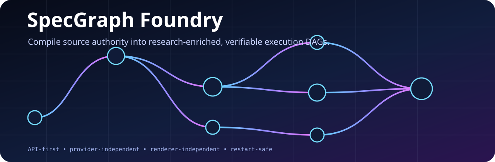

<p align="center">
  
</p>

<p align="center">
  <a href="https://github.com/mjmichaelware/specgraph-foundry/actions/workflows/ci.yml">
    
  </a>
  <a href="LICENSE">
    
  </a>
  
  
</p>

# SpecGraph Foundry

**Source documents are not prompts. They are compilable authority.**

SpecGraph Foundry is a generic platform for converting complex project
documentation into complete, research-enriched, independently verifiable
software blueprints.

## Processing pipeline


```mermaid
flowchart LR
    A[Source Authorities] --> B[Immutable Ingestion]
    B --> C[Atomic Extraction]
    C --> D[Coverage Validation]
    D --> E[Gap Matrix]
    E --> F[Deep Research]
    F --> G[Evidence Reconciliation]
    G --> H[Complete Specification]
    H --> I[Authority Graph]
    I --> J[Execution DAG]
    J --> K[Implementation Workers]
    K --> L[Independent Verification]
    L --> J
```

## Two graph types

| Graph | Purpose | Cycles |
|---|---|---:|
| Authority Graph | Requirements, evidence, decisions, conflicts, relationships | Allowed |
| Execution DAG | Dependency-safe implementation order | Forbidden |

## Pass 0 capabilities

- project persistence
- source-document hashing
- authority and execution graphs
- execution-cycle prevention
- dependency-ready node calculation
- SQLite local development
- Supabase PostgreSQL migration
- HTTP JSON API
- secret-presence diagnostics
- Apache-2.0 licensing
- tests and GitHub Actions

## Run

```bash
cd ~/specgraph-foundry
export PYTHONPATH="$PWD/src"

python -m specgraph_foundry init
python -m specgraph_foundry demo
python -m specgraph_foundry doctor
python -m specgraph_foundry serve
```

## Planned visualization adapters

| Capability | Candidate |
|---|---|
| Editable DAG | React Flow |
| Hierarchical layout | ELK |
| Analytical graph | Cytoscape.js |
| Large graph | Sigma.js |
| Charts | Apache ECharts |
| Markdown diagrams | Mermaid |
| Static exports | Graphviz |

## Planned execution adapters

- Supabase Queues
- GitHub Actions
- OpenCode
- GitHub Models
- Vertex AI
- Cloud Tasks
- Cloud Run Jobs
- Prefect
- Temporal
- Dagster
- ATROPOS

## Anti-stub doctrine

SpecGraph Foundry must reject:

- placeholder implementations
- fake hard-coded success
- disconnected components
- unreachable features
- meaningless tests
- source-less requirements
- provider self-verification
- hidden unresolved decisions
- generated boilerplate presented as completion

## License

Apache-2.0.

- `LICENSE`
- `NOTICE`
- `THIRD_PARTY_NOTICES.md`
- `docs/legal/LICENSING.md`
- `docs/legal/DEPENDENCY_LICENSE_POLICY.md`
- `docs/legal/ASSET_LICENSE_POLICY.md`

**Compile the truth. Research the gaps. Prove the plan.**
## Byte-complete ingestion

The ingestion engine now provides:

- strict UTF-8 validation;
- immutable SHA-256 source fingerprints;
- exact byte counts and line counts;
- deterministic Markdown section detection;
- exact byte and line coordinates;
- bounded UTF-8-safe chunks;
- gap and overlap detection;
- complete byte reconstruction;
- duplicate-source rejection;
- durable ingestion-run records.

```bash
python -m specgraph_foundry create-project \
  example-project \
  "Example Project"

python -m specgraph_foundry ingest-file \
  PROJECT_ID \
  ./source-document.md

python -m specgraph_foundry verify-document \
  DOCUMENT_ID
```
## Research evidence engine

- durable research-task leases
- worker ownership enforcement
- lease expiration and reclamation
- evidence fingerprints
- evidence reliability scores
- evidence-required conclusions
- justified applicability decisions
- task event history
- retryable failures
- project completeness matrices

```bash
python -m specgraph_foundry claim-research PROJECT_ID WORKER_ID
python -m specgraph_foundry research-task TASK_ID
python -m specgraph_foundry gap-matrix PROJECT_ID
```
## Authority and execution planning

The planning backend provides:

- typed atomic-requirement relationships;
- dependency-cycle rejection;
- authority graph generation;
- contract, implementation, and verification stages;
- cross-requirement dependency ordering;
- unresolved-research readiness blocking;
- deterministic plan fingerprints;
- idempotent plan synthesis;
- stored structural verification findings.

```bash
python -m specgraph_foundry add-relation \
  PROJECT_ID \
  DEPENDENT_ATOM_ID \
  REQUIRED_ATOM_ID \
  REQUIRES

python -m specgraph_foundry synthesize-plan \
  PROJECT_ID

python -m specgraph_foundry verify-plan \
  PLAN_ID
```
## Verifiable execution exports

Verified plans can be exported as deterministic,
checksummed, provider-independent handoff directories.

Each export includes:

- `manifest.json`
- `checksums.sha256`
- `project.json`
- `sources.json`
- `atoms.json`
- `research.json`
- `authority_graph.json`
- `execution_graph.json`
- `traceability.json`
- `integration_bindings.json`
- `atropos_handoff.json`
- `implementation_blueprint.md`

Integration bindings reject secret-bearing configuration.
Runtime credentials remain outside source authority and
outside exported bundles.

```bash
python -m specgraph_foundry bind-integration \
  PROJECT_ID \
  ATROPOS \
  RUNTIME \
  '{"repository":"mjmichaelware/ATROPOS","mode":"local"}'

python -m specgraph_foundry export-plan \
  PLAN_ID \
  --output-root .specgraph/exports

python -m specgraph_foundry verify-export \
  EXPORT_ID
```
## Runtime receipts and independent completion gates

SpecGraph Foundry does not trust a runtime system's
success claim by itself. ATROPOS and other runtimes submit
immutable execution receipts, which Foundry independently
evaluates before completing a plan node.

Enforced gates include:

- `NO_EMPTY_IMPLEMENTATION`
- `NO_CONSTANT_FAKE_RESULT`
- `NO_DISCONNECTED_PUBLIC_COMPONENT`
- `NO_UNREACHABLE_FEATURE`
- `NO_MEANINGLESS_TEST`
- `NO_SOURCELESS_REQUIREMENT`
- `NO_UNRESEARCHED_IMPLEMENTATION`
- `NO_SELF_VERIFICATION`
- `NO_MIXED_FILE_RESPONSIBILITY`
- `NO_UNJUSTIFIED_NOT_APPLICABLE_DIMENSION`

Runtime node state is stored per execution run. The
immutable execution DAG remains separate from operational
claims, attempts, leases, receipts, findings, and events.

```bash
python -m specgraph_foundry start-execution \
  PLAN_ID \
  ATROPOS \
  RUNTIME_RUN_ID

python -m specgraph_foundry claim-execution-node \
  EXECUTION_RUN_ID \
  WORKER_ID

python -m specgraph_foundry verify-execution-run \
  EXECUTION_RUN_ID
```
## Policy-controlled provider routing

Provider choice is now deterministic, persisted, and
independent from source authority, rendering, and runtime
execution.

Canonical route law:

1. `LOCAL_TOOLCHAIN`
2. `FREE_READY_PROVIDER`
3. `FREE_FALLBACK_PROVIDER`
4. `COOLDOWN_QUEUE`
5. `OFFLINE_DEGRADED_MODE`
6. `PAID_EMERGENCY_ONLY_BY_EXPLICIT_UNLOCK`

Provider and renderer metadata cannot contain credentials.
Paid routing requires both project-policy authorization and
an explicit, expiring, capacity-limited unlock.

```bash
python -m specgraph_foundry set-routing-policy \
  PROJECT_ID \
  --enable-paid-emergency

python -m specgraph_foundry configure-provider \
  PROJECT_ID \
  LOCAL_TOOLCHAIN \
  LOCAL_TOOLCHAIN \
  LOCAL \
  0 \
  '["CODE_PATCH","BUILD","TEST"]'

python -m specgraph_foundry provider-health \
  PROVIDER_ID \
  READY

python -m specgraph_foundry route-capability \
  PROJECT_ID \
  CODE_PATCH \
  --offline-capable
```


## Supabase authentication and project ownership

Hosted projects are owned by a Supabase Auth user through
`projects.owner_id`.

Every public table has an authenticated project-owner RLS
policy. Child records resolve ownership through their
authoritative parent project, and policies also reject
cross-project foreign-key combinations.

Anonymous API clients receive no table privileges. The
`service_role` remains available for trusted backend
administration and runtime synchronization.


## PostgreSQL and Supabase runtime mode

SQLite remains the default offline and mobile-local
backend.

A hosted PostgreSQL backend is selected when
`SPECGRAPH_DATABASE_URL` is configured. Hosted project
creation also requires `SPECGRAPH_OWNER_ID`, containing
the UUID of an existing Supabase Auth user.

```bash
export SPECGRAPH_DATABASE_URL='postgresql://...'
export SPECGRAPH_OWNER_ID='00000000-0000-0000-0000-000000000000'
python -m specgraph_foundry init
```

Hosted schema creation is controlled exclusively through
`supabase/migrations`. Runtime service constructors never
execute their SQLite bootstrap DDL against PostgreSQL.

Psycopg server-side prepared statements are disabled so
the adapter remains compatible with Supavisor transaction
pooling as well as direct and session-mode connections.


## Backend v1 hosted release audit

The final release audit runs the complete source-to-runtime
workflow against hosted Supabase PostgreSQL. It creates a
temporary Supabase Auth owner, verifies RLS isolation,
compiles and exports a plan, exercises the ATROPOS receipt
protocol, rejects empty implementation and self-verification,
detects receipt tampering, restores the evidence, and deletes
all temporary hosted records.

Run it inside the Ubuntu proot environment:

```bash
scripts/run_hosted_release_audit.sh
```

The sanitized result is written to:

```text
~/specgraph-hosted-audit.json
```
